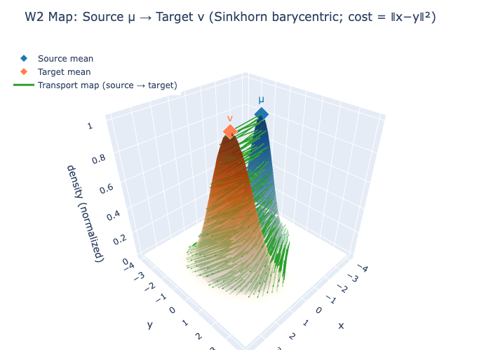

# SPX Vol Surface - Optimal Transport Analysis

**W₁/W₂ optimal transport on SPX vol surfaces: comparing risk-neutral vs physical densities, variance risk premium, and regime proxy.**
 
---

## Definitions

See [docs/VRP_DEFINITIONS.md](docs/VRP_DEFINITIONS.md) for full specification. Summary:

- **Horizon** $`H`$: Fixed in calendar days (e.g., $`H=7`$). $`\tau_t = H/365`$ (years).
- **SVI total variance** $`w^{\text{ATM}}_t = w_t(0,\tau_t)`$ at ATM. **Annualized IV²**: $`IV^2_{t,\text{ann}} = w^{\text{ATM}}_t / \tau_t`$. **ATM IV** (vol): $`IV_{t,\text{ann}} = \sqrt{w^{\text{ATM}}_t / \tau_t}`$.
- **Forward RV**: $`RV_{t,H} = \sum_i r_{t+i}^2`$ over window spanning $`\geq H`$ calendar days. **Annualized**: $`RV_{t,\text{ann}} = RV_{t,H} \times (365 / \text{span\_days}_t)`$.
- **VRP**: $`VRP_{t,H} = RV_{t,\text{ann}} - IV^2_{t,\text{ann}}`$ (both annualized; horizon-matched).
- **Stress**: Top decile of forward $`RV_{t,\text{ann}}`$. Calm = bottom decile.

---

## Precursor: IV Surface Dynamics & RV-IV Convergence

Before comparing distributions, we measure how the implied volatility surface evolves over time and how realized variance converges to implied variance as options approach expiry.

| Experiment | Finding |
|------------|---------|
| **IV surface over time** | ATM total variance (w) and skew by tau bucket (7D–90D). Chart: `iv_surface_over_time.png`. |
| **RV/IV² by horizon** | 5d: mean 0.84; 7d: mean 0.89. Ratio &lt; 1 ⇒ IV rich vs RV (typical VRP). Chart: `rv_iv_ratio_by_horizon.png`. |
| **Convergence by DTE** | For 7-day options, mean RV/IV² ≈ 1.03 (RV converges to IV² at expiry). Chart: `rv_iv_convergence_by_dte.png`. |

Run: `python scripts/experiment_iv_rv_convergence.py` → `outputs/report/iv_rv_convergence/`.

---

## Overview

We compare **risk-neutral ($Q$)** and **physical ($P$)** distributions from SPX options using Wasserstein distances.

- **$`W_1(Q, Q_{\text{prev}})`$** - surface shift proxy. We observe a positive association in-sample with forward VRP (correlation $`\approx 0.54`$).
- **$`W_2(Q, P)`$** - Q–P divergence. Under our FHS-GARCH $`P`$, $`W_2`$ is *lower* in stress (0.035) than calm (0.047); see [DIAGNOSTICS](outputs/report/ot_findings/DIAGNOSTICS.md).

$Q$ recovered via Breeden–Litzenberger; $P$ via FHS-GJR-GARCH (Filtered Historical Simulation with leverage GARCH; see Methodology).

---

## Main Findings

| Metric | Meaning | Finding |
|--------|---------|---------|
| **$`W_1(Q, Q_{\text{prev}})`$** | Risk-neutral density change day-to-day | High $`W_1`$ → RV tends to exceed IV; low $`W_1`$ → RV $`\approx`$ IV. In-sample association only. |
| **$`W_2(Q, P)`$** | Q–P divergence | Regime proxy. Calm: 0.047, Stress: 0.035 (lower in stress). |
| **Decile spread** | $`D_{10} - D_1`$ mean(VRP) | $`\approx 0.17`$ ($`D_1 \approx -0.004`$, $`D_{10} \approx 0.17`$) when sorted by $`W_1`$. |

---

## Visualizations

 

 

**Interactive:** [w1_w2_timeseries](outputs/report/ot_findings/w1_w2_timeseries.html) · [decile_chart](outputs/report/ot_findings/decile_chart.html) · [w1_vs_rv_iv](outputs/report/ot_findings/w1_vs_rv_iv_scatter.html) · [3D surfaces](outputs/report/ot_findings/surfaces_q_vs_p_7d.html) · [ot_w2_map](outputs/report/ot_findings/ot_w2_map.html) · [ot_w1_map](outputs/report/ot_findings/ot_w1_map.html)

---

## Methodology

1. **SVI fit** → implied vol surface [Gatheral & Jacquier (2014)]
2. **Call prices** → from SVI
3. **Q recovery** → Breeden–Litzenberger ($`q(K) = e^{rT} \partial^2 C/\partial K^2`$). Central finite differences on call prices; clip negative density, renormalize. No analytic SVI derivatives.
4. **P estimation** → FHS-GJR-GARCH (Filtered Historical Simulation with GJR-GARCH(1,1)):
   - 252-day rolling window of daily log returns (strict, no look-ahead).
   - Fit GJR-GARCH(1,1): $`r_t = \sigma_t \varepsilon_t`$ with variance $`\sigma_{t+1}^2 = \omega + \alpha r_t^2 + \gamma I(r_t<0) r_t^2 + \beta \sigma_t^2`$. Student-t innovations. The leverage term $`\gamma I(r<0) r^2`$ captures asymmetric volatility (negative shocks amplify variance).
   - Standardized residuals $`\hat{\varepsilon}_t = r_t / \hat{\sigma}_t`$ are approximately iid. We bootstrap these (not raw returns) to preserve volatility clustering.
   - Forward simulate: for each path, $`r_{t+h} = \sigma_{t+h} \varepsilon^*`$ with GARCH recursion; sum to $`H`$-day cumulative return. KDE over log-moneyness.
5. **$`Q_{\text{prev}}`$** → Constant maturity: interpolate previous day's fitted surface to $`\tau`$ days to expiry, recover $`Q_{\text{prev}}`$ on same grid. (Config: `distances.use_constant_maturity_q_prev: true`.)
6. **Distances** → $`W_1`$, $`W_2`$ via quantile-based formulas [Villani (2003)]

**Formulas (1D):**

$$
W_1(\mu, \nu) = \int_0^1 |F_\mu^{-1}(u) - F_\nu^{-1}(u)|\, du
$$

$$
W_2(\mu, \nu) = \sqrt{\int_0^1 (F_\mu^{-1}(u) - F_\nu^{-1}(u))^2\, du}
$$

---

## Limitations

- Only 7D $`Q`$ in main analysis; cross-tenor pending.
- $`P`$ uses FHS-GJR-GARCH; jump-diffusion or other models may further refine $`W_2`$ interpretation.
- No transaction-cost modeling; strategy backtests are next.
- Subperiod robustness of $`W_1`$–VRP association not yet validated.

---

## Setup & Run

```bash
pip install -e .   # or: uv sync
```

**Data:** Place options + yield CSVs per `configs/data.yaml`. Default paths: `data/raw/Options/spx-weeklies-filtered.csv` and `data/raw/Risk-Free/yield_panel_daily_frequency_monthly_maturity.csv`.

```bash
python -m pipeline.run --config configs/base.yaml --skip-cache
PYTHONPATH=. python scripts/generate_ot_report.py
python scripts/gaussian_w1_w2_visualization.py
```

Or run all at once: `./scripts/run_full_pipeline.sh`

**Reproducibility:** Config hash in `outputs/cache/{hash}/`. Key knobs: `configs/tau_buckets.yaml`, `configs/physical.yaml` (window_days, n_sims, garch_model), `configs/density.yaml` (k_grid). Cache can be disabled with `--skip-cache` on pipeline run. FHS uses `seed` from `configs/base.yaml`.

**Outputs:** `outputs/report/ot_findings/` (HTML, PNG, DIAGNOSTICS.md) · `outputs/report/factor/` (PNG) · `outputs/cache/` · `outputs/features/`

**IV surface & RV–IV convergence:** `python scripts/experiment_iv_rv_convergence.py` → `outputs/report/iv_rv_convergence/` (IV surface over time, RV/IV² by horizon, convergence by days-to-expiry).

**Note:** After the pipeline, run `generate_ot_report.py` and `gaussian_w1_w2_visualization.py` for full visuals (3D surfaces, decile chart, W1/W2 maps). P estimation (Stage 7) takes ~100 min with `n_sims=10000`; reduce to 2000 in `configs/physical.yaml` for faster runs (~20 min).

**Gaussian W₁/W₂ demo:** `pip install -e ".[gaussian-demo]"` then `python scripts/gaussian_w1_w2_visualization.py` → `outputs/report/ot_findings/ot_w{1,2}_map.{html,png}`

---

## References

- Breeden, D.T. & Litzenberger, R.H. (1978). Prices of state-contingent claims implicit in option prices. *Journal of Business*, 51(4), 621–651.
- Gatheral, J. & Jacquier, A. (2014). Arbitrage-free SVI volatility surfaces. *Quantitative Finance*, 14(1), 59–71.
- Glosten, L.R., Jagannathan, R., & Runkle, D.E. (1993). On the relation between the expected value and the volatility of the nominal excess return on stocks. *Journal of Finance*, 48(5), 1779–1801. (GJR-GARCH)
- Villani, C. (2003). *Topics in Optimal Transportation*. AMS.
