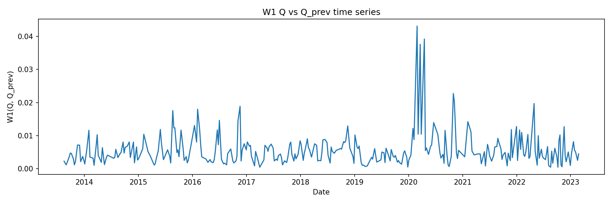
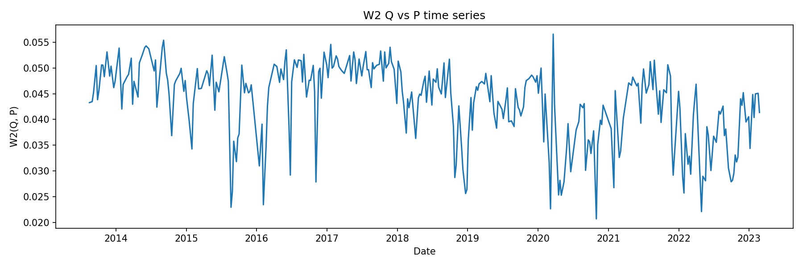
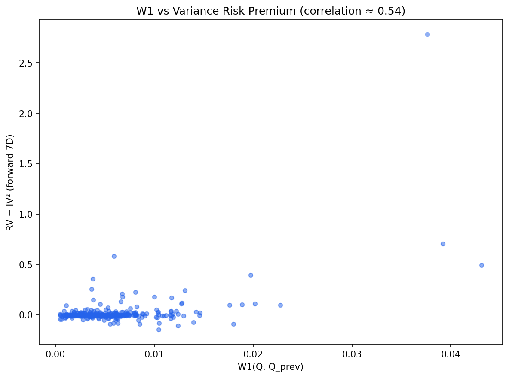

# SPX Vol Surface — Optimal Transport Analysis

Optimal transport ($W_1$, $W_2$) applied to SPX options: risk-neutral vs physical distributions, variance risk premium, and regime proxy.

---

## Definitions

See [docs/VRP_DEFINITIONS.md](docs/VRP_DEFINITIONS.md) for full specification. Summary:

- **Horizon $H$**: Fixed in calendar days (e.g., $H=7$). $\tau_t = H/365$ (years).
- **SVI total variance** $ w^{\mathrm{ATM}}_t = w_t(0,\tau_t) $ at ATM. **Annualized IV²**: $IV^2_{t,\mathrm{ann}} = w^{\mathrm{ATM}}_t / \tau_t$. **ATM IV** (vol): $IV_{t,\mathrm{ann}} = \sqrt{w^{\mathrm{ATM}}_t / \tau_t}$.
- **Forward RV**: $RV_{t,H} = \sum_i r_{t+i}^2$ over window spanning $\geq H$ calendar days. **Annualized**: $RV_{t,\mathrm{ann}} = RV_{t,H} \times (365 / \mathrm{span\_days}_t)$.
- **VRP**: $VRP_{t,H} = RV_{t,\mathrm{ann}} - IV^2_{t,\mathrm{ann}}$ (both annualized; horizon-matched).
- **Stress**: Top decile of forward $RV_{t,\mathrm{ann}}$. Calm = bottom decile.

---

## Overview

We compare **risk-neutral ($Q$)** and **physical ($P$)** distributions from SPX options using Wasserstein distances.

- **$W_1(Q, Q_{\mathrm{prev}})$** — surface shift proxy. We observe a positive association in-sample with forward VRP (correlation $\approx 0.54$).
- **$W_2(Q, P)$** — Q–P divergence. Under our bootstrap $P$, $W_2$ is *lower* in stress (top RV decile) than calm; see [DIAGNOSTICS](outputs/report/ot_findings/DIAGNOSTICS.md).

$Q$ recovered via Breeden–Litzenberger; $P$ via iid bootstrap of historical returns (see Methodology).

---

## Main Findings

| Metric | Meaning | Finding |
|--------|---------|---------|
| **$W_1(Q, Q_{\mathrm{prev}})$** | Risk-neutral density change day-to-day | High $W_1$ → RV tends to exceed IV; low $W_1$ → RV $\approx$ IV. In-sample association only. |
| **$W_2(Q, P)$** | Q–P divergence | Regime proxy. Lower in stress than calm under our $P$; see diagnostics. |
| **Decile spread** | $D_{10} - D_1$ mean(VRP) | $\approx 0.17$ ($D_1 \approx -0.004$, $D_{10} \approx 0.17$) when sorted by $W_1$. |

---

## Visualizations

 

 

**Interactive:** [w1_w2_timeseries](outputs/report/ot_findings/w1_w2_timeseries.html) · [decile_chart](outputs/report/ot_findings/decile_chart.html) · [w1_vs_rv_iv](outputs/report/ot_findings/w1_vs_rv_iv_scatter.html) · [3D surfaces](outputs/report/ot_findings/surfaces_q_vs_p_7d.html)

---

## Methodology

1. **SVI fit** → implied vol surface [Gatheral & Jacquier (2014)]
2. **Call prices** → from SVI
3. **Q recovery** → Breeden–Litzenberger ($q(K) = e^{rT} \partial^2 C/\partial K^2$). Central finite differences on call prices; clip negative density, renormalize. No analytic SVI derivatives.
4. **P estimation** → Iid bootstrap of daily log returns over 252-day rolling window; resample with replacement to construct $H$-day cumulative returns, histogram over log-moneyness. No parametric (GARCH/GBM) component.
5. **$Q_{\mathrm{prev}}$** → Constant maturity: interpolate previous day's fitted surface to $\tau$ days to expiry, recover $Q_{\mathrm{prev}}$ on same grid. (Config: `distances.use_constant_maturity_q_prev: true`.)
6. **Distances** → $W_1$, $W_2$ via quantile-based formulas [Villani (2003)]

**Formulas (1D):**

$W_1(\mu, \nu) = \int_0^1 |F_\mu^{-1}(u) - F_\nu^{-1}(u)|\, du$

$W_2(\mu, \nu) = \sqrt{\int_0^1 (F_\mu^{-1}(u) - F_\nu^{-1}(u))^2\, du}$

---

## Limitations

- Only 7D $Q$ in main analysis; cross-tenor pending.
- $P$ is simplified bootstrap; richer models (GARCH, jumps) may change $W_2$ interpretation.
- No transaction-cost modeling; strategy backtests are next.
- Subperiod robustness of $W_1$–VRP association not yet validated.

---

## Setup & Run

```bash
pip install -e .   # or: uv sync
```

**Data:** Place options + yield CSVs per `configs/data.yaml`.

```bash
python -m pipeline.run --config configs/base.yaml
PYTHONPATH=. python scripts/generate_ot_report.py
PYTHONPATH=. python scripts/rv_iv_analysis.py
```

**Reproducibility:** Config hash in `outputs/cache/{hash}/`. Key knobs: `configs/tau_buckets.yaml`, `configs/physical.yaml` (window_days, bootstrap_n), `configs/density.yaml` (k_grid). Cache can be disabled with `--skip-cache` on pipeline run. Bootstrap uses `seed` from `configs/base.yaml`.

**Outputs:** `outputs/report/ot_findings/` (HTML, PNG, DIAGNOSTICS.md) · `outputs/report/factor/` (PNG) · `outputs/cache/` · `outputs/features/`

---

## References

- Breeden, D.T. & Litzenberger, R.H. (1978). Prices of state-contingent claims implicit in option prices. *Journal of Business*, 51(4), 621–651.
- Gatheral, J. & Jacquier, A. (2014). Arbitrage-free SVI volatility surfaces. *Quantitative Finance*, 14(1), 59–71.
- Villani, C. (2003). *Topics in Optimal Transportation*. AMS.
