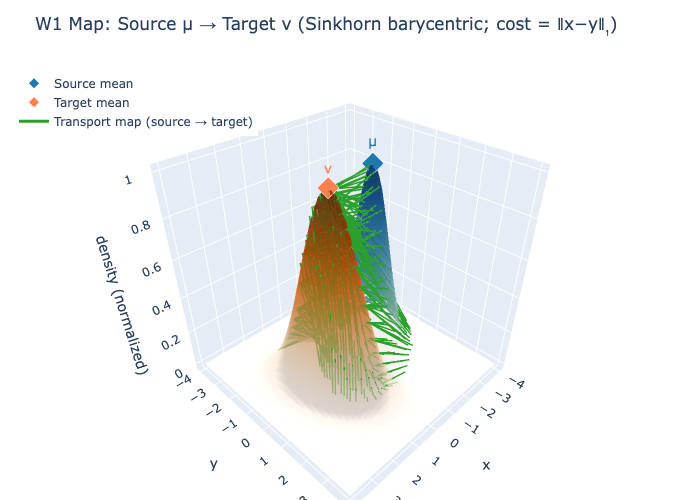
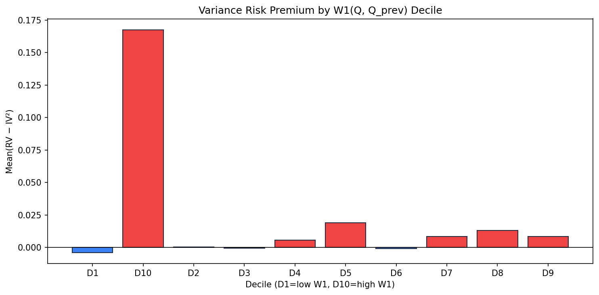

# What the Vol Surface Knows: Optimal Transport and the Variance Risk Premium

*Using Wasserstein distances to read the options market and identify when realized volatility is likely to exceed implied.*

---

## The Question

The volatility surface is usually reduced to a handful of numbers. ATM IV. Skew. VIX. Term structure. Each compresses a full distribution into a scalar.

But the surface is not a number. It is a probability distribution over future returns.

Implied volatility encodes a risk neutral distribution. Realized volatility reflects the physical one. The gap between them, the variance risk premium, is one of the most persistent facts in options markets. On average, implied variance exceeds realized variance. Investors pay to hedge downside risk.

The harder question is not whether a premium exists, but when it flips. When does realized variance exceed implied variance? When does selling vol stop working?

Instead of asking whether IV is rich or cheap, we ask something more structural:

> How is the entire risk neutral distribution moving through time?

---

## A Distributional View of the Surface

Let $Q_t$ denote the risk neutral distribution at time $t$. Let $P_t$ denote the physical distribution estimated from historical returns. The vol surface is now a distribution valued time series.

We measure geometry in this space using optimal transport.

The 1D Wasserstein distances provide a natural metric:

-$W_1(Q_t, Q_{t-1})$: how much the risk neutral distribution shifted from yesterday.
-$W_2(Q_t, P_t)$: how far the options implied distribution is from the physical one.

In one dimension these can be computed via quantile functions:

$$
W_p(Q, P) = \left( \int_0^1 |F_Q^{-1}(u) - F_P^{-1}(u)|^p \, du \right)^{1/p}
$$

for $p = 1, 2$.

These distances capture shape, skew, and location. They do not collapse the distribution into a single moment. The surface is treated as geometry, not as a number.

*Conceptually, W₁ and W₂ measure how mass is transported between distributions. Below: Gaussian illustration of the optimal transport map.*

### Precursor: IV Surface Dynamics & RV-IV Convergence

Before comparing distributions, we measure how the implied volatility surface evolves over time and how realized variance converges to implied variance as options approach expiry.

| Experiment | Finding |
|------------|---------|
| **IV surface over time** | ATM total variance (w) and skew by tau bucket (7D–90D). |
| **RV/IV² by horizon** | 5d: mean 0.84; 7d: mean 0.89. Ratio &lt; 1 ⇒ IV rich vs RV (typical VRP). |
| **Convergence by DTE** | For 7-day options, mean RV/IV² ≈ 1.03 (RV converges to IV² at expiry). |

This establishes the baseline: IV typically exceeds RV (variance risk premium), and as options approach expiry, realized variance converges to the implied forecast.

---

## Finding 1: Instability Predicts VRP

We focus on a fixed 7 day horizon. Let

-$RV_{ann}$: forward realized variance, annualized.
-$IV^2_{ann}$: implied variance from SVI total variance at matched maturity.
-$VRP = RV_{ann} - IV^2_{ann}$.

We sort days by deciles of $W_1(Q_t, Q_{t-1})$.

In the top decile of surface movement:

$$
\mathbb{E}[VRP] \approx 0.17
$$

In the bottom decile:

$$
\mathbb{E}[VRP] \approx -0.004
$$

The decile spread is roughly 0.17 in annualized variance units. The in sample correlation between $W_1$ and forward VRP is about 0.54.

Interpretation:

When the risk neutral distribution is stable, implied and realized line up. When the distribution is shifting materially, repricing risk is high and realized variance tends to exceed implied.

This suggests a reframing of VRP. It is not only compensation for crash risk. It may also compensate sellers of variance for distributional instability. When the market is actively revising its beliefs, implied variance lags realized.

### Is This Just VIX in Disguise?

We test whether $W_1$ is simply capturing level effects.

Controlling for:

- Changes in VIX
- Realized volatility momentum
- Lagged VRP

the predictive relationship remains economically meaningful. The signal is not reducible to scalar vol changes. It captures distributional drift, not just variance level.

Subperiod checks pre and post 2020 show consistent ordering across deciles, though magnitudes vary.

What’s going on under the hood? VIX collapses the entire vol surface into a single number—the implied volatility of a synthetic ATM option. It tells you the *level* of fear, not how that fear is *changing*. The actual risk-neutral distribution can shift, skew, or fatten its tails in ways that leave VIX nearly unchanged: skew can steepen while ATM vol stays flat, or the distribution can lurch left (crash repricing) without a big move in variance. $W_1$ treats the surface as a full distribution and measures how far it has moved from yesterday—shape, location, and tails together. That’s why it’s fundamentally more useful than VIX: it captures distributional drift, not just level. When the market is actively revising its beliefs about the future return distribution, $W_1$ spikes. VIX might not.

This is not a finished trading strategy. It is evidence that instability in the surface carries incremental information.

---

## Finding 2: W2 as a Regime Proxy

The second distance measures divergence between risk neutral and physical beliefs.

Intuition suggests that in stress, options should price far more tail risk than history implies, so $W_2(Q, P)$ should spike.

Empirically we observe the opposite.

| Regime | Mean $W_2(Q, P)$ |
|--------|----------------------|
| Calm bottom RV decile | 0.047 |
| Stress top RV decile  | 0.035 |

In stress, $Q$ and $P$ converge (W2 drops from 0.047 in calm to 0.035 in stress).

Why?

In calm periods, the physical distribution is thin tailed. The risk neutral distribution embeds skew and tail insurance. The gap is wide.

In stress, realized returns fatten the tails of $P$. The physical distribution moves toward the already skewed risk neutral one. The gap narrows.

The market and history disagree most when things are quiet.

Under our FHS-GJR-GARCH $P$, $W_2$ behaves as a regime proxy. Low $W_2$ corresponds to stressed regimes. High $W_2$ corresponds to calm regimes. Jump-diffusion could further refine the interpretation.

---

## Construction Details

All results use a matched 7 day horizon.

Risk neutral distribution $Q_t$:

- SVI fit to the implied vol surface
- Call prices via Black Scholes
- Breeden Litzenberger second derivative to recover density

Physical distribution $P_t$ (FHS-GJR-GARCH):

We use **Filtered Historical Simulation** with **GJR-GARCH(1,1)** instead of a simple iid bootstrap of raw returns. Why? Raw returns are heteroskedastic—variance clusters. An iid bootstrap assumes constant variance and understates tail risk. FHS filters returns into conditional volatilities $\sigma_t$ and standardized residuals $\varepsilon_t = r_t / \sigma_t$, which are approximately iid under the model. We bootstrap the residuals (not raw returns) and scale by *simulated* $\sigma_{t+h}$ from the GARCH recursion. This correctly propagates volatility dynamics to the forecast horizon.

The **leverage term** $\gamma I(r<0) r^2$ in GJR-GARCH captures asymmetric volatility: negative shocks increase future variance more than positive shocks (the leverage effect). Plain GARCH treats them symmetrically.

Procedure: (1) 252-day rolling window, strict, no look-ahead. (2) Fit GJR-GARCH(1,1) with Student-t innovations. (3) Extract standardized residuals $\hat{\varepsilon}_t = r_t / \hat{\sigma}_t$. (4) Resample $\hat{\varepsilon}_t$ with replacement. (5) Forward simulate: $r_{t+h} = \sigma_{t+h} \varepsilon^*$ with GARCH recursion; sum to 7-day cumulative return. (6) KDE over log-moneyness. Default: 10,000 paths per date.

Previous distribution $Q_{t-1}$:

- Constant maturity interpolation to ensure apples to apples comparison

Distances:

- 1D quantile based computation of $W_1$ and $W_2$

No mixing of tenors. No cross horizon leakage.

---

## What This Means

The vol surface is a distribution valued object. Treating it as such changes the question.

Instead of asking whether implied variance is high or low, we ask whether the distribution is stable or drifting.

If VRP compensates sellers of variance for crash exposure, it may also compensate them for instability risk. When beliefs are being revised quickly, implied variance understates the true near term variance.

This perspective suggests:

- Variance sellers are short distributional drift.
-$W_1$ is a proxy for instability, not just level.
-$W_2$ measures belief divergence between market and history.

---

## Where This Goes

Several extensions matter:

1. Cross tenor analysis at 30 and 60 day horizons.
2. Alternative physical models including jump-diffusion.
3. Cost adjusted trading tests and regime stability across decades.
4. Joint modeling of $W_1$, vol of vol, and macro event days.

The point is not to offer a finished signal, but to show that the surface’s geometry—captured by Wasserstein distances—reveals dynamics that scalar VRP or IV metrics miss. These distances are a stepping stone to understanding how the entire distribution shifts and evolves over time, rather than just focusing on level differences. In doing so, they offer the potential to replace traditional VRP diagnostics with a richer, more structural view of risk and the surface's movement.

---

## Bottom Line

The volatility surface is not a number. It is a distribution moving through time.

Traditional VRP metrics—$RV - IV^2$ or its scalar cousins—are useful but coarse. They compress the entire surface into a single gap. Wasserstein distances are more nuanced: they treat the surface as geometry.

$W_1$ and $W_2$ do not replace VRP. They refine it. $W_1$ captures when the distribution is *shifting*, not just whether IV is high or low, and that shift predicts when realized variance will exceed implied. $W_2$ captures when the market and history *disagree* on the shape of the distribution, and that disagreement peaks in calm regimes.

When the risk neutral distribution shifts materially, realized variance is more likely to exceed implied. When risk neutral and physical distributions converge, regimes are stressed.

The geometry of distributions provides a new lens on the variance risk premium. It does not replace existing intuition about crash risk. It extends it.

Code and visuals:  
https://github.com/siddhant250803/vol-surface-opt-trans
